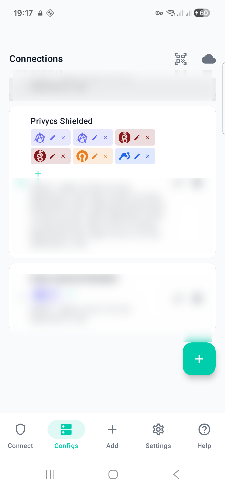
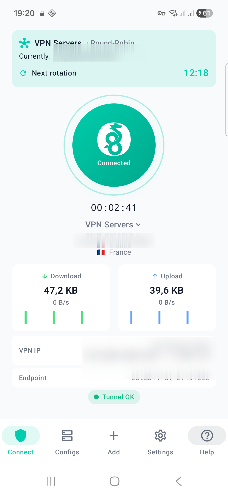
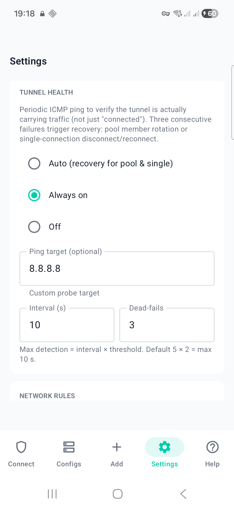

# Privycs VPN

**One app, four protocols, your servers.** A multi-protocol VPN
management client for Android and Desktop (Windows / macOS / Linux),
with iOS planned. Works with any standards-compliant VPN server — not
tied to a single provider.

[](https://github.com/hoep/privycs-vpn/releases)
[](https://github.com/hoep/privycs-vpn/actions/workflows/android-release.yml)
[](https://github.com/hoep/privycs-vpn/actions/workflows/desktop-release.yml)
[](https://github.com/hoep/privycs-vpn/actions/workflows/ios-release.yml)
[](LICENSE)

<p align="center">
  
  
  
  
</p>

---

## What this is — and isn't

**Privycs is a VPN management client, not a VPN service.** You bring your
own server (or commercial-provider configs); Privycs does the work of
*managing* them: multi-protocol switching, connection pools with
rotation, per-pool split tunnel, a real kill switch, per-app routing,
encrypted backup.

If you have ever opened a 600-config archive from a commercial VPN
provider and wished there were one sane way to manage it — this is that
tool.

---

## Why this exists

There is no shortage of VPN apps. There is a shortage of VPN apps that:

- **Speak every real-world protocol in one binary** — AmneziaWG,
  WireGuard, OpenVPN and IPSec/IKEv2. Most clients pick one. Privycs runs
  all four through a single `VpnService` slot on Android and the same
  daemon on Desktop, and switches protocol on a live connection with one
  tap.
- **Treat 600 configs as one thing.** The Connection Pool feature
  collapses a whole archive into a single virtual connection with three
  rotation policies (Geo-Nearest, Round-Robin, Random), pre-warm probes
  and recovery against dead servers.
- **Offer a per-pool split tunnel** — a bypass-CIDR list per pool that
  routes specific IP ranges (your home LAN, a captive-portal range)
  around the tunnel, IPv4 + IPv6.
- **Have a real kill switch** — a sinkhole `VpnService` / OS-firewall
  ruleset that blocks all traffic if the tunnel drops unexpectedly, not
  just "disconnect on drop".
- **Carry no telemetry** — no tracking, no analytics, no crash SDK, no
  cloud dependency. Configs stay on your device unless you explicitly
  export an encrypted backup.

---

## Features

### Free
- **Multi-protocol** — AmneziaWG, WireGuard, OpenVPN, IPSec/IKEv2 in one app
- **Config import** — `.conf` (WireGuard / AmneziaWG), `.ovpn` (OpenVPN),
  `.sswan` (Android IPSec), `.mobileconfig` (iOS IPSec)
- **QR-code import** — scan a code from your gateway
- **One saved connection, one protocol**
- **Manual connect / disconnect** with live transfer stats and a sparkline
- **Kill switch** — sinkhole-based traffic blocking on tunnel drop
- **Tunnel health monitor** — periodic ICMP probe with a status indicator
- **Home-screen widget + Quick Settings tile** (Android)
- **Encrypted local backup** — AES-256-GCM with PBKDF2

### Pro
- **Multi-protocol per connection** — one connection holding WireGuard +
  OpenVPN + IPSec, switchable live, with automatic health-driven failover
- **Multiple connections** — unlimited saved connections
- **Connect-on-Demand & network rules** — auto-connect by Wi-Fi network or
  mobile data, with per-network trusted/untrusted rules
- **Gateway sync** — pull config updates from your own Privycs server
- **Connection pools** — import large config archives, three rotation
  policies, pre-warm and dead-server recovery
- **Per-pool split tunnel** — bypass-CIDR list, IPv4 + IPv6

Pricing and Pro details are on [privycs.com](https://www.privycs.com).

---

## Compatibility

Works with any VPN server speaking standard protocols:

| Protocol | Tested with |
|----------|-------------|
| WireGuard | wg-quick, Mullvad, ProtonVPN, IVPN, Synology, OPNsense, OpenWrt |
| AmneziaWG | AmneziaWG servers and the Privycs gateway (DPI-resistant WireGuard) |
| OpenVPN | OpenVPN Community, Access Server, pfSense, OPNsense, Synology, AirVPN |
| IPSec/IKEv2 | strongSwan, native macOS / iOS profiles, MikroTik, enterprise IKEv2 |

Privycs is gateway-agnostic — it imports and runs any standards-compliant
config file. It also has first-class support for
[Privycs](https://github.com/hoep/privycs), the companion self-hosted VPN
management server, for users running their own infrastructure.

---

## Download

Stable releases are on the
**[GitHub Releases page](https://github.com/hoep/privycs-vpn/releases/latest)**
— signed Android APK (ARMv8 / ARMv7 / x86_64) and Desktop builds for
Linux, macOS and Windows.

Google Play, Apple App Store and Microsoft Store listings are planned.

---

## Building from source

### Desktop (Windows / macOS / Linux)

```bash
cd desktop
go install github.com/wailsapp/wails/v2/cmd/wails@latest
wails build                 # produces ./build/bin/privycs-vpn
```

Requires Go 1.23+, Node.js 20+ and the Wails v2 CLI. Platform
dependencies: GTK3 + WebKit2GTK (Linux), Xcode Command Line Tools
(macOS), WebView2 (Windows, bundled). `go build ./...` is a quick way to
verify the Go backend compiles.

### Android

```bash
cd android

# One-time submodule prep — autogen strongSwan, build OpenSSL, apply the
# vendor patches. Re-run after every `git submodule update`.
ANDROID_NDK_ROOT=/path/to/ndk ./scripts/prepare-strongswan.sh
./scripts/prepare-amneziawg.sh

./gradlew assembleDebug
```

Requires Android Studio, Android SDK 35, JDK 17 and NDK 27.3.13750724.
The vendor-patch workflow is documented in
[`android/vendor/strongswan-patches/README.md`](android/vendor/strongswan-patches/README.md).

### iOS / macOS *(TestFlight beta)*

A SwiftUI app with a Network Extension — WireGuardKit, the native
`NEVPNProtocolIKEv2` API, AmneziaWG (gomobile), and OpenVPN via
OpenVPNAdapter. Because OpenVPNAdapter/OpenVPN3 is **AGPL-3.0**, the iOS /
macOS (App Store) app as a whole is distributed under **AGPL-3.0**. The full
source is public (FOSS), which satisfies the copyleft, and App Store
distribution is covered by an additional permission — the same model
ProtonVPN uses. See [`ios/LICENSE_NOTES.md`](ios/LICENSE_NOTES.md) +
[`ios/EXCEPTIONS.md`](ios/EXCEPTIONS.md).

---

## FAQ

**Is Privycs a VPN service?**
No. Privycs is a *client* for VPN servers you already have or obtain
elsewhere. It runs no servers and sees no traffic. You bring the config
(`.conf`, `.ovpn`, `.sswan`, `.mobileconfig`); Privycs manages the
connection.

**Why not just use the WireGuard / OpenVPN / strongSwan apps?**
Each speaks one protocol. If your server exposes WireGuard *and* OpenVPN
as failover, you would otherwise need two apps and switch manually.
Privycs does both in one app, on the same connection, with a tap.

**Does it log anything?**
No analytics, no crash reporters, no telemetry. The apps make no network
calls outside the tunnel except optional gateway sync (if you configure
an API key) and one-time DNS lookups during pool import.

**Does it work on a rooted / jailbroken device?**
Yes. There are no root checks, attestation or device fingerprinting.

**Where do I report a bug?**
[Open an issue](https://github.com/hoep/privycs-vpn/issues/new). Logs
help — Settings → View Logs, with any secrets redacted.

---

## Architecture

```
desktop/      Desktop app — Go backend + Vue 3 frontend (Wails v2)
android/      Android app — Kotlin + Jetpack Compose
  vendor/     pinned ics-openvpn, strongSwan and AmneziaWG submodules
ios/          iOS app (planned)
screenshots/  README assets
```

---

## Contributing

Contributions are welcome — see [CONTRIBUTING.md](CONTRIBUTING.md).
Please open an issue to discuss significant changes first. For security
reports, see [SECURITY.md](SECURITY.md).

---

## License

**GPL-3.0** — see [LICENSE](LICENSE) — for the Android + Desktop apps (the
Android app links GPL-2.0 ics-openvpn / strongSwan → combined work GPL-3.0;
the Desktop app *invokes* OpenVPN/strongSwan as external binaries, so it
stays GPL-3.0). The **iOS / macOS (App Store) app is AGPL-3.0**, because it
links the AGPL-3.0 OpenVPNAdapter — the full source is public (FOSS), which
satisfies the copyleft, and App Store distribution is covered by
[`ios/EXCEPTIONS.md`](ios/EXCEPTIONS.md) (GPLv3/AGPLv3 §7). WireGuard and
AmneziaWG components are MIT / permissively licensed. Full open-source
attributions are listed in-app under Settings → About → Open-Source Licenses.

---

## Related projects

- [Privycs](https://github.com/hoep/privycs) — the self-hosted VPN
  management server this client optionally pairs with
- [privycs.com](https://www.privycs.com) — website and documentation
