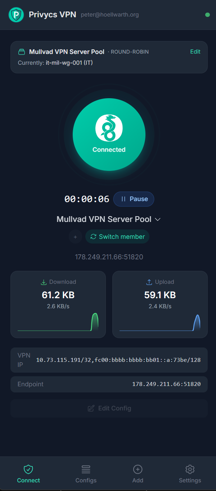
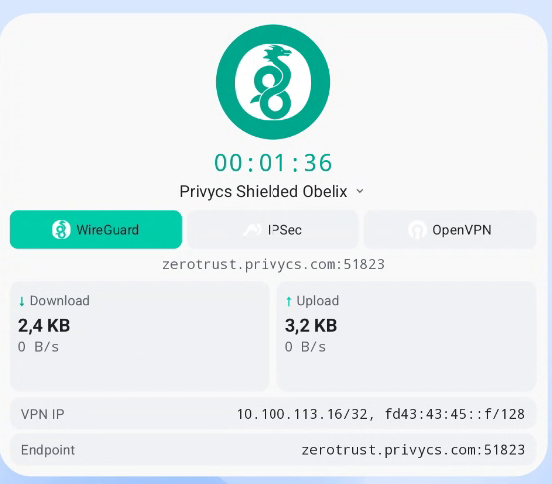

# Privycs VPN

**One app, three protocols, your servers.** A multi-protocol VPN management client for Android, iOS (planned), and Desktop (Windows / macOS / Linux). Works with any VPN server — not tied to a single provider.

<!--
  Static badges only while this repo is private — shields.io's
  dynamic GitHub-API queries can't authenticate against private
  repos, so they render as "no release found" / "repo or workflow
  not found" until the repo is made public. When that happens,
  switch back to the dynamic versions:
    https://img.shields.io/github/v/release/hoep/privycs-vpn
    https://img.shields.io/github/actions/workflow/status/hoep/privycs-vpn/android-release.yml?branch=main
    https://img.shields.io/github/actions/workflow/status/hoep/privycs-vpn/desktop-release.yml?branch=main
    https://img.shields.io/github/downloads/hoep/privycs-vpn/total
    https://img.shields.io/github/stars/hoep/privycs-vpn?style=social
-->

[](https://github.com/hoep/privycs-vpn/releases/latest)
[](https://github.com/hoep/privycs-vpn/releases)
[](#license)

<p align="center">
  
  &nbsp;&nbsp;
  
</p>

---

## What this is — and isn't

**Privycs is a VPN management client, not a VPN service.** You bring your own server (or commercial-provider configs); Privycs handles the heavy lifting around *managing* them: multi-protocol switching, connection pools with rotation, per-pool split tunnel, kill switch, per-app routing, encrypted backup.

If you've ever opened a 600-config `.zip` from a commercial VPN provider and wished there were a single sane way to manage them — this is the tool.

---

## Why this exists

There's no shortage of VPN apps. There IS a shortage of VPN apps that:

- **Speak all three real-world protocols in one binary** — WireGuard, OpenVPN, IPSec/IKEv2. Most clients pick one. Privycs runs all three through a single `VpnService` slot on Android and through the same daemon on Desktop.
- **Treat 600 configs as one thing.** The Connection Pool feature collapses a whole archive into a single virtual connection with three rotation policies (Geo-Nearest, Round-Robin, Random), pre-warm probes, and recovery against dead servers.
- **Per-pool split tunnel.** Bypass-CIDR list per pool that excludes specific IP ranges (your home LAN, a geo-blocked banking site, a captive portal range) from the tunnel. WireGuard `AllowedIPs` complement, OpenVPN `route net_gateway`, IPv4 + IPv6 dual-stack.
- **Have a real Kill Switch.** Sinkhole `VpnService` blocks ALL traffic if the tunnel drops unexpectedly. Implemented at the OS firewall level (iptables/pf/WFP), not just "disconnect on drop".
- **No telemetry, no tracking, no cloud dependency.** Configs stay on your device unless you explicitly export an encrypted backup.

---

## Features

### Free
- **Multi-protocol** — WireGuard, OpenVPN, IPSec/IKEv2 in one app
- **Manual config import** — `.conf` (WG), `.ovpn` (OVPN), `.sswan` (Android IPSec), `.mobileconfig` (iOS IPSec)
- **QR code import** — scan a code from your gateway
- **1 connection with 1 protocol**
- **Manual connect/disconnect** with live transfer stats + sparkline
- **Kill Switch** — sinkhole-based traffic blocking on tunnel drop
- **Home-screen widget + Quick Settings tile** (Android)
- **Manual pause** with auto-reconnect timer
- **Encrypted local backup** — AES-256-GCM with PBKDF2

### Pro (6 gates, €9.99 single platform / €19.99 cross-platform bundle)
- **Multi-protocol per connection** — same connection with WG + OVPN + IPSec
- **Multiple connections** — unlimited
- **Connect-on-Demand** — auto-connect on WiFi SSID, mobile data, app start
- **Gateway sync** — pull config updates from your Privycs server via API key
- **Connection Pools** — import 600-config archives, three rotation policies, pre-warm + slot alternation, dead-server recovery
- **Per-Pool Split Tunnel** — bypass-CIDR list with RFC1918 toggle, IPv4+IPv6 dual-stack

See [www.privycs.com/blog/connection-pools](https://www.privycs.com/blog/connection-pools) and [www.privycs.com/blog/split-tunnel](https://www.privycs.com/blog/split-tunnel) for technical deep-dives.

---

## Compatibility

Works with any VPN server speaking standard protocols:

| Protocol | Tested with |
|----------|-------------|
| WireGuard | wg-quick, Mullvad, ProtonVPN, AzireVPN, IVPN, Privycs, Synology, OPNsense, OpenWrt |
| OpenVPN | OpenVPN Community, OpenVPN Access Server, pfSense, OPNsense, Synology, QNAP, AirVPN |
| IPSec/IKEv2 | strongSwan, Cisco AnyConnect (IKEv2), Fortinet, native macOS/iOS profiles, Mikrotik |

Plus first-class support for [Privycs](https://github.com/hoep/privycs) — the companion self-hosted VPN management server — for users running their own infrastructure.

---

## Download

**Stable releases on the [GitHub Releases page](https://github.com/hoep/privycs-vpn/releases/latest)** — Android APK (signed, ARMv8/v7/x86_64), Desktop binaries (`.exe`/`.deb`/`.dmg`).

Coming soon: Google Play Store · Apple App Store · Microsoft Store.

---

## Building from source

### Desktop (Windows / macOS / Linux)
```bash
cd desktop
go install github.com/wailsapp/wails/v2/cmd/wails@latest
wails build
```
Requires Go 1.23+, Node.js 20+, Wails v2 CLI. Platform-specific deps: GTK3 + WebKit2GTK (Linux), Xcode CLI Tools (macOS), WebView2 (Windows, bundled).

### Android
```bash
cd android
./gradlew assembleDebug
```
Requires Android Studio Iguana+, Android SDK 34, JDK 17.

### iOS *(planned)*
SwiftUI app with Network Extension. WireGuardKit + native NEVPNProtocolIKEv2. OpenVPN initially excluded — the available open-source iOS wrapper (`OpenVPNAdapter`) is AGPL-3.0, which would force the entire Privycs iOS app to be AGPL'd (compliance risk for a paid Pro tier). The commercial OpenVPN SDK license ($500–2000/year) economically justifies adding it only when iOS-specific OpenVPN demand is significant. Other App Store apps that ship OpenVPN (NordVPN, ExpressVPN, OpenVPN Connect official) either pay for the commercial SDK or are already AGPL/own-IP — their path is open to us, just not in v1.

---

## FAQ

**Is Privycs a VPN service?**
No. Privycs is a *client* for VPN servers you already have or buy elsewhere. We don't run servers, we don't see your traffic, we don't have a "free tier with bandwidth". You bring your own config (`.conf`, `.ovpn`, `.sswan`, `.mobileconfig`) and Privycs manages the connection.

**Why not just use the WireGuard / OpenVPN / strongSwan apps?**
Each of those apps speaks one protocol. If you have a server that exposes WireGuard AND OpenVPN as failover, you'd need two apps and switch between them manually. Privycs does both in one app, on the same connection, with a tap to switch protocols mid-session.

**What is a Connection Pool?**
A way to import a whole archive of configs (e.g. a Mullvad `.zip` with 600 servers) as one virtual connection. Privycs picks an active server by policy (closest country, deterministic rotation, random) and rotates to a fresh one on a schedule for Round-Robin pools. Member health is tracked; dead servers are skipped. See the [pool deep-dive blog post](https://www.privycs.com/blog/connection-pools).

**What does the per-pool split tunnel do?**
Each pool can carry a bypass-CIDR list (custom CIDRs + a "private networks" toggle for RFC1918 + IPv6 ULA). Traffic to those ranges goes around the VPN; everything else still tunnels. Useful for keeping your home LAN reachable, bypassing geo-blocked sites, or working around a captive portal. WireGuard + OpenVPN supported, IPSec is not (traffic-selector negotiation is server-side). See the [split-tunnel deep-dive blog post](https://www.privycs.com/blog/split-tunnel).

**Why are some features Pro?**
The free tier covers single-connection, single-protocol VPN use which is what 80% of users actually need. Pro features (multi-protocol per connection, multiple connections, on-demand rules, gateway sync, pools, per-pool split tunnel) are for power users who'd otherwise pay €5–10/month for similar utility tools (Termius, Tailscale Personal Pro). One-time €9.99 lifetime — no subscription.

**Is the bundle worth it?**
If you'll use Privycs on more than one platform: yes. €19.99 covers Android + iOS + Desktop (vs €9.99 + €10.99 + €9.99 = €30.97 individually). License key cross-redeems on all three. Sold on [privycs.com](https://www.privycs.com) (not in the platform stores — store policies don't allow cross-platform bundle SKUs).

**Do you log anything?**
No. The apps have no analytics, no crash reporters, no telemetry. They make no network calls outside the VPN tunnel itself except (a) optional gateway-sync if you've configured an API key, (b) one-time DNS lookups during pool import to resolve member countries, and (c) a Geo-IP probe to plain-HTTPS endpoints (Cloudflare trace, ipify) for the Pool's Geo-Nearest policy. All optional, all visible in the source.

**Can I use this with a corporate VPN?**
Yes for WireGuard, OpenVPN, and standards-compliant IPSec/IKEv2. NOT for Cisco AnyConnect SSL or proprietary protocols (Pulse Secure, GlobalProtect, Fortinet SSL VPN). Those need dedicated clients.

**Does it work on a rooted/jailbroken device?**
Yes. We don't do root checks, attestation, or device fingerprinting.

**Where do I report a bug?**
[Open an issue](https://github.com/hoep/privycs-vpn/issues/new). Logs help — Settings → View Logs to grab the relevant section.

---

## Architecture

```
desktop/                  # Desktop app (Go + Vue 3, Wails v2)
  *.go                    # Go backend (VPN service, config, API client)
  frontend/               # Vue 3 + Tailwind CSS frontend

android/                  # Android app (Kotlin, Jetpack Compose)
  app/                    # Main application module
  vendor/ics-openvpn      # ics-openvpn pinned vendor copy
  vendor/strongswan       # strongSwan Android frontend pinned

ios/                      # iOS app (planned — SwiftUI + Network Extension)

screenshots/              # Marketing assets used in this README
```

---

## License

GPL-3.0 — required because the Android app links against GPL-2.0 libraries (ics-openvpn, strongSwan) and the iOS app will link against AGPL-3.0 OpenVPNAdapter.

WireGuard components (wireguard-android, WireGuardKit) are MIT.
iOS IPSec uses Apple's native NEVPNProtocolIKEv2 API (no third-party dep).

---

## Related projects

- [Privycs](https://github.com/hoep/privycs) — self-hosted VPN management server (the optional companion server-side this client speaks to)
- [Privycs website + docs](https://www.privycs.com)

---

## Contributing

Contributions welcome. Open an issue first to discuss significant changes — keeps both sides from writing code that doesn't fit the roadmap.
